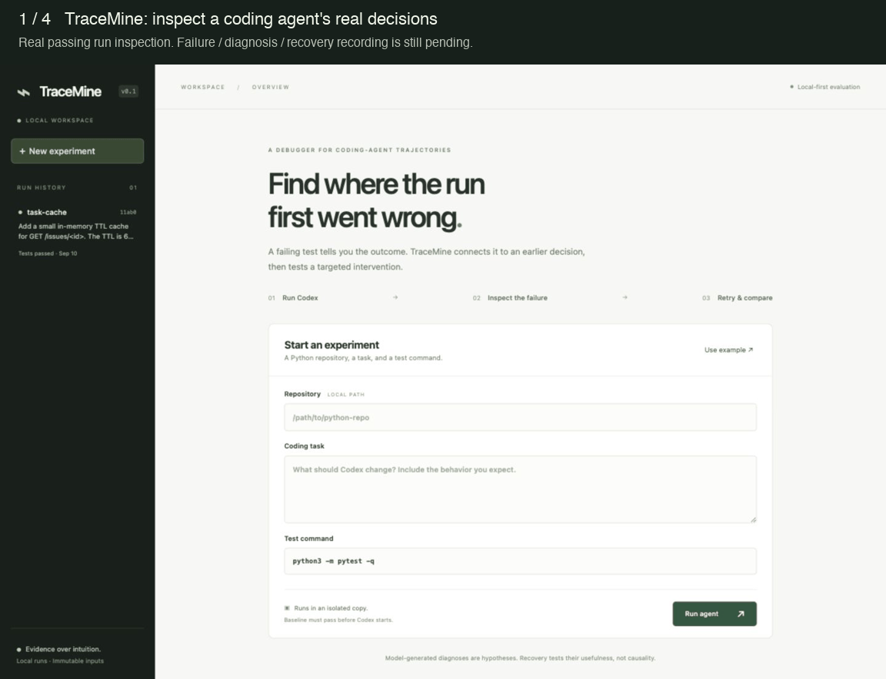
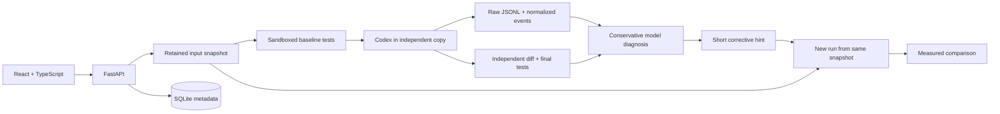

# TraceMine

[](https://github.com/tannedpeach/tracemine/actions/workflows/check.yml)

**Find the likely first consequential mistake in a failed coding-agent trajectory—and test whether a targeted hint helps it recover.**

TraceMine is a local debugger for coding-agent developers. Give it a Python repository, a coding task, and a test command. Inspect the agent's decisions alongside the actual diff and failing tests, then retry from the same input snapshot.

```text
repo + task → Codex trajectory → failing tests → likely earlier mistake
                                                     ↓
                       compare outcomes ← fresh retry + targeted hint
```

> Build status: the complete workflow is implemented and being validated. A genuine failed-run/recovery recording is still required before calling this portfolio-ready. No synthetic trajectory is presented as a real experiment.



This 18-second walkthrough inspects a **real passing run**. It is a sequence of UI captures, not a live execution or a failure/recovery demonstration.

## Why this problem

The last failing command often isn't the most informative part of a coding-agent run. The useful question is which earlier decision put the agent on the wrong path, and whether a small intervention changes the outcome.

This project extends my experience building LLM evaluation and failure-mining infrastructure at Tinder. That work taught me to prioritize failures that are worth inspecting, instead of treating every model example as equally useful. TraceMine applies that idea to repository changes, tool trajectories, and executable tests.

## Try it locally

Prerequisites: **Python 3.11+, Node 20+, Git, and macOS** (or Linux with `bubblewrap` installed and user namespaces enabled). Windows is not supported. Dependencies are pinned in `requirements.lock` and `frontend/package-lock.json`.

```bash
git clone https://github.com/tannedpeach/tracemine.git
cd tracemine
./scripts/setup.sh
./scripts/dev.sh
```

Open **http://127.0.0.1:8000**. The same local server serves the React UI and API.

Setup imports a checksummed real Codex recording. Click **task-cache** in run history to inspect its trajectory, tests, diff, and redacted logs without authentication or model calls. Reproduce its patch and test outcome independently:

```bash
source .venv/bin/activate
python scripts/reproduce.py 11ab0728156444b08799fe59b7e85d8f
```

This applies the recorded patch in a disposable copy and reruns baseline and final tests. It does not rerun the model.

For live experiments, install and authenticate the [Codex CLI](https://developers.openai.com/codex/cli). Verify `codex --version`, `codex login status`, and `codex exec --help`. TraceMine uses the installed CLI's account; live runs and diagnosis consume that account's model usage. The integration has been exercised with `codex-cli 0.153.4` and requires `--json`, `--ephemeral`, and `--ignore-user-config`.

1. Click **Use example** to load the included Flask repository and caching task.
2. Leave the test command as `python3 -m pytest -q`.
3. Click **Run agent**. A passing baseline is required before Codex starts.
4. Inspect events, raw output, and the final diff. A successful run says only that the supplied test command passed.
5. On a diagnosed failed run, click **Retry with diagnosis**, then compare the linked attempts.

A new model invocation is nondeterministic. The included task may succeed on the first attempt; that is a legitimate result, not a broken demo.

For your own repository, install its Python dependencies into TraceMine's `.venv` first. The source directory must be separate from the run storage directory. Uncommitted regular files are included; Git metadata, environments, caches, `.env` files, and common test temporary directories are excluded. Symlinks and special files are rejected. The snapshot limit is 100 MiB.

### CLI and development

```bash
source .venv/bin/activate
python scripts/run.py examples/task-cache \
  'Add a health endpoint and a test for it.' \
  --test-command 'python3 -m pytest -q'

./scripts/check.sh
```

Stop the web server before running the CLI against the same storage directory, or pass `--data` to use a separate directory. One process owns each database. Runs are serialized within that process; up to four can be queued. For frontend hot reload, run `npm --prefix frontend run dev` alongside the API; API requests use Vite's local proxy.

## What happens in a run



The implementation stays small: a process owner, repository utilities, a Codex adapter, a state machine, a typed storage boundary, and a local API. [Architecture and tradeoffs](docs/architecture.md) explain the details.

- **Source isolation:** copies contain independent files and fresh Git metadata. Baseline and final tests also have separate copies, so test side effects do not contaminate the agent input or the captured diff.
- **Stable recovery inputs:** retries use retained snapshots, never a fresh read of a source directory that may have changed. A SHA-256 content digest is checked before execution.
- **Auditability:** every stdout/stderr byte is retained locally, including malformed JSONL. The timeline is a view of that evidence. Event counts and unique tool-action counts are distinct.
- **Conservative diagnosis:** schema validation, existing-event checks, an explicit `insufficient_evidence` result, and visible model errors. Confidence is subjective, not calibrated.
- **Honest comparisons:** actual final test exit codes, unique tool actions, changed files, and agent duration. A successful retry is described as “recovery succeeded after intervention,” never proof of causality.

## Limitations and trust boundary

- Python-first; local repositories only. No GitHub cloning, exact checkpoint replay, or multi-provider orchestration.
- This is a **local tool for trusted repositories**, not a hostile-code evaluation service. Test processes have read access to the machine, restricted writes to their disposable directory, and no network. Codex uses its workspace-write sandbox. Do not use production credentials or untrusted repositories. TraceMine strips most inherited environment variables, but cannot make arbitrary local code harmless.
- The supplied test command is the primary success signal. Agents can change tests; inspect the diff. A pass does not establish requirement coverage or semantic correctness.
- Diagnosis is model-generated and may be wrong. The context is bounded; truncation is disclosed and full evidence stays in logs. Structured validation checks references, not causal truth.
- Recovery adds a hint to a fresh attempt. It does not replay the exact execution state, control model randomness, or prove causality.
- Event coverage depends on Codex JSONL. Started/completed records are preserved; action counts deduplicate tool item IDs. Internal reasoning and per-edit diffs are not guaranteed.
- Environment setup is explicit. Environments are not copied from the source, dependency installation isn't automatic, and the sandbox may reject tests that need external writes or network.
- The server binds to loopback. Origin checks, an in-memory request token, and host validation guard the local command API. Do not expose it to a network or run multiple server workers.
- Limits: 10-minute agent timeout, 2-minute test timeout, 5-minute diagnosis timeout, 64 MiB per process output stream. Timeout and cancellation terminate the owned process group and retain partial logs. A hard crash may leave descendants; inspect the process tree before restarting.

Local data lives in `.tracemine/` (ignored by Git), or `TRACEMINE_DATA`. It includes source code, absolute paths, prompts, model output, SQLite metadata, and immutable inputs. Use the **Artifacts** tab for original logs and review them before sharing. There is no telemetry in TraceMine; Codex makes the model-service requests required for live runs.

## Validation

`./scripts/check.sh` runs backend lint/format checks, Python type checking, isolation/lifecycle/API tests, frontend formatting, strict TypeScript compilation, and the production build. Test doubles are explicitly labeled and never exported as real run evidence. CI runs the same checks on macOS.

See [experiment ledger](docs/experiments.md) for actual live results and [submission review](docs/submission-review.md) for the final portfolio audit.
